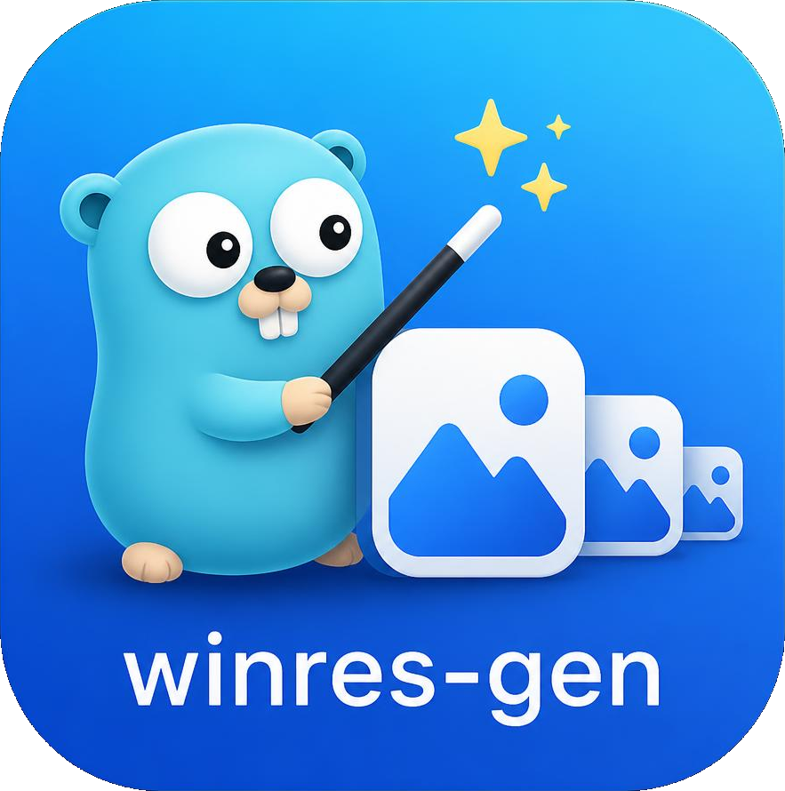

# winres-gen



Turns an ordinary image into the Windows resources a Go program needs to carry
an icon and version metadata: a multi-size `.ico` plus one `.syso` object per
architecture.

Go's linker automatically picks up a `.syso` file sitting next to the `main`
package, so embedding an icon is a matter of generating the file once and
committing it. Nothing in your build scripts or CI has to change. The
`_windows_<arch>` suffix acts as a build constraint, so the resources are linked
into Windows builds only, and because the `.syso` is a prebuilt artifact,
cross-compiling from a Linux or macOS machine works with no extra tooling.

## Install

Every push to `main` publishes a [release](https://github.com/chriswirz/winres-gen/releases/latest)
carrying static binaries for Windows, Linux and macOS on amd64 and arm64, Linux
`.rpm` and `.deb` packages, and a `SHA256SUMS` file covering all of them.

### Download a binary

Assets are named `winres-gen-<os>-<arch>` (`.exe` on Windows), so a download is
one command. Linux/macOS:

```sh
os="$(uname -s | tr '[:upper:]' '[:lower:]')"   # linux or darwin
arch="$(uname -m | sed 's/x86_64/amd64/; s/aarch64/arm64/')"
curl -fL -o winres-gen \
  "https://github.com/chriswirz/winres-gen/releases/latest/download/winres-gen-${os}-${arch}"
chmod +x winres-gen
sudo mv winres-gen /usr/local/bin/
```

Windows (PowerShell):

```powershell
Invoke-WebRequest -OutFile winres-gen.exe `
  https://github.com/chriswirz/winres-gen/releases/latest/download/winres-gen-windows-amd64.exe
```

Or with the GitHub CLI, which fetches whatever assets you name:

```sh
gh release download --repo chriswirz/winres-gen \
  --pattern 'winres-gen-linux-amd64' --pattern 'SHA256SUMS'
```

### Verify the download

`SHA256SUMS` lists every asset in the release, so check the one you took:

```sh
curl -fLO https://github.com/chriswirz/winres-gen/releases/latest/download/SHA256SUMS
grep 'winres-gen-linux-amd64$' SHA256SUMS | sha256sum --check
```

### Linux packages

The `.rpm` and `.deb` packages install the binary to `/usr/bin/winres-gen` and
the README to `/usr/share/doc/winres-gen/`. Substitute the version you are
installing for `<version>`. The package version drops the tag's leading
zeros (release `v0.1.0004` ships `0.1.4-1`), so copy the exact filename from
the releases page:

```sh
# Fedora / RHEL / openSUSE
curl -fLO https://github.com/chriswirz/winres-gen/releases/latest/download/winres-gen-<version>-1.x86_64.rpm
sudo dnf install ./winres-gen-<version>-1.x86_64.rpm

# Debian / Ubuntu
curl -fLO https://github.com/chriswirz/winres-gen/releases/latest/download/winres-gen_<version>_amd64.deb
sudo apt install ./winres-gen_<version>_amd64.deb
```

arm64 builds are published alongside them, as `.aarch64.rpm` and `_arm64.deb`.

### Build from source

Go 1.25 or newer:

```sh
git clone https://github.com/chriswirz/winres-gen.git
cd winres-gen
go build -o winres-gen .
```

Or install straight into `$(go env GOPATH)/bin`, no clone needed:

```sh
go install github.com/chriswirz/winres-gen@latest
```

## Use

```sh
winres-gen [flags] <image>
```

Reads a PNG, JPEG or GIF. Writes `<name>.ico`, a web `favicon.ico` and one
`<name>_windows_<arch>.syso` per architecture into the output directory.

```sh
# Pad a non-square logo onto a transparent square canvas
winres-gen -mode pad -out ../myapp logo.png

# Crop to the largest centred square instead, with full metadata
winres-gen -mode crop -out ../myapp \
  -exe myapp.exe -version 1.2.0.0 \
  -product "My App" -description "Does the thing" \
  -company "Someone" -copyright "Copyright (c) 2026 Someone" \
  logo.png
```

Then drop the `.syso` files into the directory holding your `main` package and
rebuild. That is the whole integration.

## Squaring a non-square source

Windows icons are square. If the source is not, pick how to fix it:

| Mode | What happens | Use when |
| --- | --- | --- |
| `pad` (default) | Centres the image on a square canvas and fills the two short sides with `-bg` (transparent by default). | Nothing may be cropped — logos with text, or art that already has its own margins. |
| `crop` | Takes the largest centred square, trimming the long edge. | The subject is centred and fills the frame, and you want the icon to fill its box. |

## Flags

| Flag | Meaning |
| --- | --- |
| `-mode <pad\|crop>` | How to square a non-square image. Default `pad`. |
| `-bg <colour>` | Pad background: `transparent`, `#rgb`, `#rrggbb` or `#rrggbbaa`. Default transparent. Ignored by `-mode crop`. |
| `-sizes <list>` | Icon sizes to generate. Default `16,24,32,48,64,128,256`. |
| `-out <dir>` | Output directory. Default `.`. |
| `-name <base>` | Base name for the output files. Defaults to the input's. |
| `-arch <list>` | Architectures to emit `.syso` files for, from `386`, `amd64`, `arm`, `arm64`. Default `amd64,arm64`. Empty means none. |
| `-ico-only` | Write only the `.ico` files. |
| `-favicon` | Also write a web `favicon.ico`. Default `true`; disable with `-favicon=false`. |
| `-favicon-name <base>` | Base name for the favicon. Default `favicon`. |
| `-favicon-sizes <list>` | Sizes inside the favicon. Default `16,32,48`. |
| `-product <text>` | Product name. |
| `-description <text>` | File description — the field Windows shows most often. |
| `-company <text>` | Company or author. |
| `-copyright <text>` | Legal copyright. |
| `-version <x.y.z.b>` | File and product version. Default `0.0.0.0`. |
| `-exe <name>` | Original filename, e.g. `myapp.exe`. Defaults to `<name>.exe`. |

The metadata flags are all optional, and populate the fields Windows shows under
Properties → Details. They are worth filling in for anything users download: a
blank Details tab is one of the signals that makes SmartScreen and cautious
users suspicious.

## The favicon

The favicon is the same artwork as the app icon, encoded at the handful of sizes
a browser actually asks for (16, 32 and 48). It is a separate file so the app
icon can keep its 256px entry, which a favicon has no use for and which makes
the file an order of magnitude larger. Drop it at your site's root, or point at
it with `<link rel="icon" href="/favicon.ico" sizes="16x16 32x32 48x48">`.

## Notes

- Sizes below 256 are written as 32-bit DIBs, which every Windows version reads.
  256×256 is written as PNG, which Windows Vista and later understand and which
  keeps the file roughly four times smaller.
- Downscaling uses a Catmull-Rom kernel. Shrinking 256px art to 16px with a
  cheaper filter turns fine detail to mush.
- Supplying a source smaller than the largest requested size prints a warning:
  upscaling only invents detail. Start from art at least 256px square.
- The generated `.ico` is a normal icon file, useful on its own for installers
  and shortcuts.

## Verifying the result

```powershell
Add-Type -AssemblyName System.Drawing
[System.Drawing.Icon]::ExtractAssociatedIcon("myapp.exe").ToBitmap().Save("check.png")
(Get-Item myapp.exe).VersionInfo
```

Explorer caches icons aggressively, so a rebuilt binary may still show the old
one in a folder view. Renaming the file, or checking with the snippet above, is
more reliable than trusting the thumbnail.
